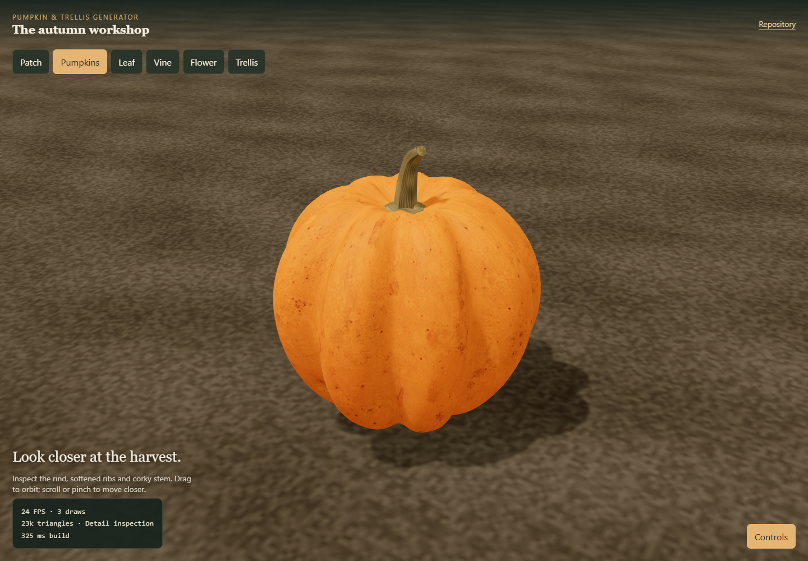
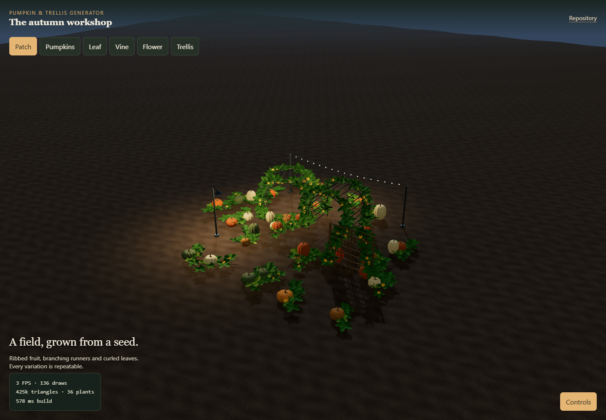

# Pumpkin & Trellis Generator

Reusable procedural autumn assets and a touch-friendly 3D workshop, extracted from Skydancer without replacing its integration.

**Free to use, modify and share — including in commercial games.** Both the project code and included assets are available under the [MIT License](LICENSE). Keep the license notice with redistributed copies; see [asset permissions](ASSET_LICENSE.md).

[Download ZIP](https://github.com/jalapenoseed/pumpkin-trellis-generator/archive/refs/heads/main.zip) · [Browse the 57 ready-to-import models](web/assets/autumn/v0.2.2) · [License](LICENSE)





The current workshop is **v0.4.0**. The bundled model library is **v0.2.2**; use the workshop's **Export GLB** button for the newer geometry and materials. The workshop runs locally with Node.js; the screenshots above are actual renders. The reference board and rind color texture are AI-generated, with [prompts and provenance](web/assets/references/PROVENANCE.md).

## Run locally

Requires Node.js 22+ and npm.

Download and extract the ZIP, or clone this repository, then open a terminal in its folder:

```sh
cd web
npm ci
npm test
npm start
```

Open http://localhost:8136/autumn.html. On a phone using the same Wi-Fi, use your computer's LAN IP with port 8136. The server listens on all interfaces; local firewall rules still apply. Stop with Ctrl+C. Set PORT to choose another port.

## Included

- Seeded round, tall, squat, flat, white, green and warty pumpkins; curved stems and recessed sockets.
- Lobed, cupped leaves, underside shading, raised veins, branching runners, blossoms and coiled tendrils.
- Metal arches, wooden trellises, fences and modular support parts.
- Seed, density, scale, growth, health, season, climbing and quality controls.
- Individual placement and session-only area painting, terrain/slope/exclusion hooks.
- Shared PBR materials, instancing, chunk culling and three geometry tiers.
- 57 versioned GLB models, closed glTF exports, thumbnails, material maps, presets and validation reports under web/assets/autumn/v0.2.2.
- Browser GLB export; runtime wind is not baked into static exports.

## Use in another game

Load Three.js 0.147.0 followed by web/src/autumn-core.js. The global AutumnAssets API accepts seeded options and terrain callbacks. The generator has no dependency on Skydancer. See the source and integration notes for available options and tier budgets.

web/src/autumn-state.js is an optional crop-state example used by the regression suite. integrations/skydancer/autumn-world.js is the existing game-specific adapter, provided as a reference; it is not loaded by this workshop.

## Export and verification

npm test checks determinism, controls, terrain exclusions, budgets and crop-state persistence. Existing export and browser QA scripts in web/tools require an isolated Chrome debugger on port 9275. Set AUTUMN_PREVIEW_URL to override their default workshop address (http://127.0.0.1:8136/autumn.html). Export with Node 22+; then run python tools/seal-autumn.py from web. Blender validation accepts the export directory after Blender's -- separator.

The imported reports describe the original Skydancer run, not a new certification of this standalone checkout. Physical iPhone Safari and console hardware remain unverified. See docs/SKYDANCER_INTEGRATION.md for historical game integration, performance measurements and known limits. Its game-build commands apply to Skydancer, not this repository.

## Provenance and status

Extracted from jalapenoseed/skydancer commit 450d9a5ff8d52837c391a3eb0feb91c9c9faa961, autumn system v0.2.2. Original procedural geometry and texture pixels; reference photographs are not redistributed. Three.js is an npm dependency under its own MIT license.

Code and included assets are released under MIT; third-party dependencies retain their own licenses. Asset Forge entries remain technical candidates pending human visual approval. The existing Skydancer implementation remains intact. This repository is a separate development snapshot; updates are not automatically synchronized.

## v0.4.0 — Garden building, lights and surface inspection

The standalone workshop now supports multiple placed trellises (24), yard lamps (8), and string-light runs (12). Open **Controls → Build your garden**, choose a placement tool, and tap the soil. For a free-standing string, tap two post positions, 0.75–18 metres apart. Choose **Done** to orbit again. **Light selected trellis** attaches a string to the selected support; it follows that support's position, rotation and dimensions. Selecting a placed trellis and applying current settings updates just that support. Removing a support also removes its attached strings.

Placed objects and lighting choices save in browser local storage. Each origin/device has its own layout. Base patch controls and painted plants are still session-only. Browser storage can be unavailable or cleared; this is not cloud synchronization. **Export GLB** includes the visible garden and painted plants, including light fixtures and emissive bulbs. Environment lighting and interactive behavior are not exported.

**Light & atmosphere** offers soft daylight, overcast, golden hour, blue hour and moonlit night, plus exposure and lamp brightness. To bound rendering cost, up to four placed fixtures provide local illumination; the remaining bulbs are emissive. Yard lamps get priority, followed by strings, in placement order. Local lights do not cast shadows.

Controls minimize on desktop and phones. The desktop ↔ button switches sides. Placement automatically minimizes phone controls and shows a Done button above the scene. Pumpkin inspection can isolate one cultivar for a closer view, with denser inspection geometry, revised ribs, a cork collar/cut stem end and longitudinal stem grain. The workshop uses a generated rind albedo alongside procedural normal/roughness maps. The reusable core retains its self-contained procedural material by default. These are generated approximations, not scanned assets or a claim of photorealistic quality. See `web/assets/references/PROVENANCE.md` for prompts and asset origin.

Validated with `node web/tools/test-autumn.cjs`, `node web/tools/verify-variance.cjs`, and `node web/tools/verify-workshop.cjs` using an isolated Chrome debugger on port 9275. The workshop suite exercises controls and actual ground clicks, reload persistence, transforms, attached-light removal, undo, lighting, generated texture loading, GLB serialization, finite vertices, and desktop/390×844 layouts. Physical iPhone Safari remains unverified. Existing bundled v0.2.2 exports have not been regenerated; use the live GLB export for current assets. This update has not been integrated into Skydancer.

## Windows shell troubleshooting

If npm's default command shell exits silently on this PC, run `node tools/test-autumn.cjs` and `node tools/serve.cjs` directly from web, or use `npm test --script-shell=powershell.exe` / `npm start --script-shell=powershell.exe`. No global npm settings need to change.


## v0.3.0 — Component variation and rendering

Open Controls to access Pumpkin, Vine, Flower and Trellis variation groups. The Natural variation slider changes the seeded spread of sizes and organic irregularity. Mixed cultivar/color choices remain mixed even at zero variance. Flower view inspects buds/open blossoms independently of seasonal suppression.

Pumpkins: width, height, ribs, groove depth, stem curl and size range.
Vines: length, branching, internode spacing, branch angle, meander, thickness and tendril coils.
Flowers: frequency, size, opening and petal count (five is botanically typical; alternatives are artistic).
Trellises: width, height, arch depth/crown rise, rail spacing and member thickness. Crown rise is capped internally below support height; climbing paths use the same arch formula.

The renderer now uses mottled PBR skin and foliage, bark fissures, tapered ridged stems, corrugated petals with raised centers, a soft environment reflection map, textured soil and tighter shadow framing. Mobile component inspections use medium geometry; field budgets remain unchanged. These are procedural approximations, not photogrammetry.

Validation: node web/tools/test-autumn.cjs and node web/tools/verify-variance.cjs. The browser check uses an isolated Chrome debugger and verifies actual geometry changes, all support types at extreme slider settings, zero flower density, deterministic seeds and finite vertices.

This section describes the historical v0.3.0 update; the current runtime is v0.4.0. Bundled asset exports and their historical validation reports remain v0.2.2. Export GLB in the workshop for the current geometry; the legacy batch export scripts still target a v0.3.0 folder. Changes in this standalone repository are not automatically deployed into Skydancer.
